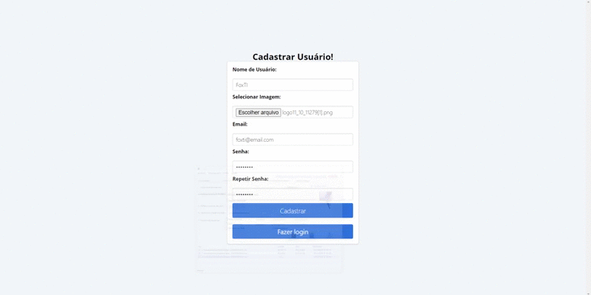
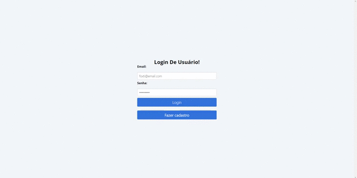

<h3 align="center">

</h3>

<h1 align="center">
   
   
   
</h1>

---

## 📄Sobre:
O projeto foi desenvolvido por mim, utilizando experiências vistas nas aulas de WEB com o Professor Carlos Silva.<br>
O sistema se constituí em cadastros, logins e uploads de imagem no banco de dados.(Back-End)<br>
Junto com um pouco de css.(Front-End)
<center style="color: green">EM CONSTANTE DESENVOLVIMENTO 🚀</center>


---

## 📱Tecnologias Utilizadas:
O projeto utilizou das seguintes tecnologias:

- [HTML5](https://developer.mozilla.org/pt-BR/docs/Web/HTML/HTML5)
- [CSS3](https://developer.mozilla.org/pt-BR/docs/Web/CSS)
- [JavaScript](https://developer.mozilla.org/pt-BR/docs/Web/JavaScript)
- [PHP](https://www.php.net/)

---

## 📁Como Baixar O Projeto:

```bash
# Clonar repositório.
$ git clone https://github.com/audisiofilho/sistema2

# Entrar no diretório.
$ cd sistema2

# Instalar dependências.
$ yarn install

# Iniciar o projeto.
$ yarn start

```
---
👾Desenvolvido Por: José Audísio Bezerra Filho.